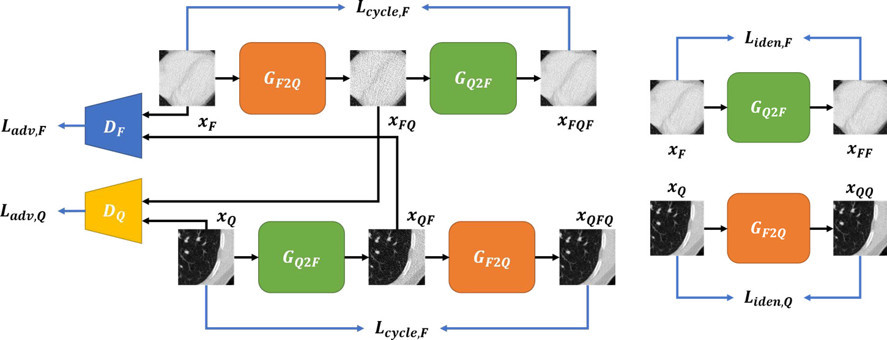
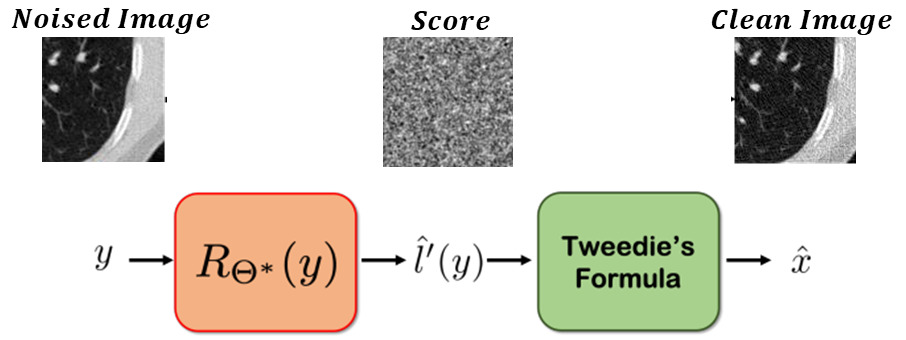
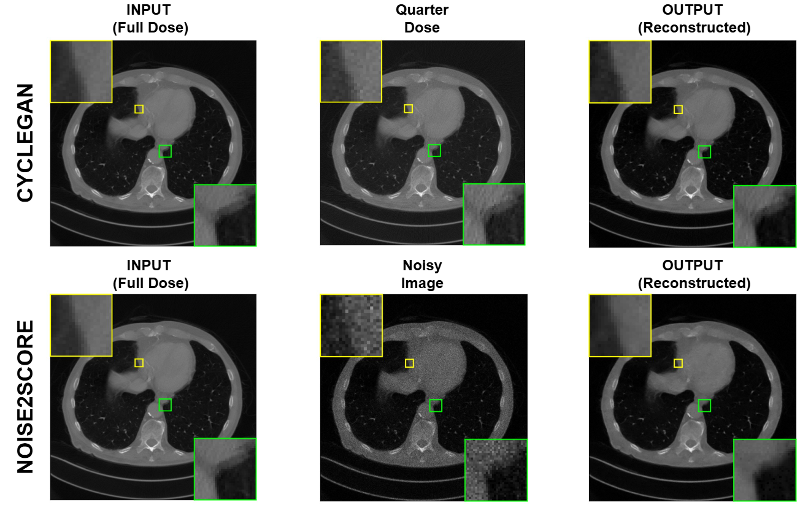
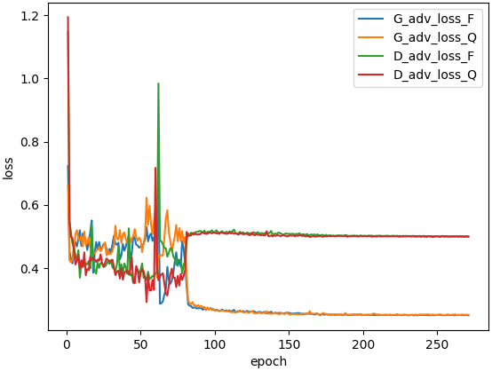
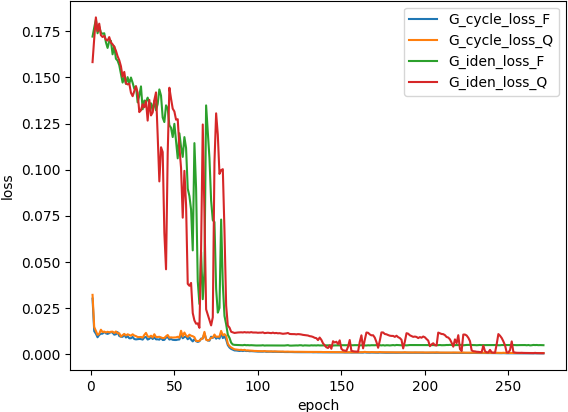
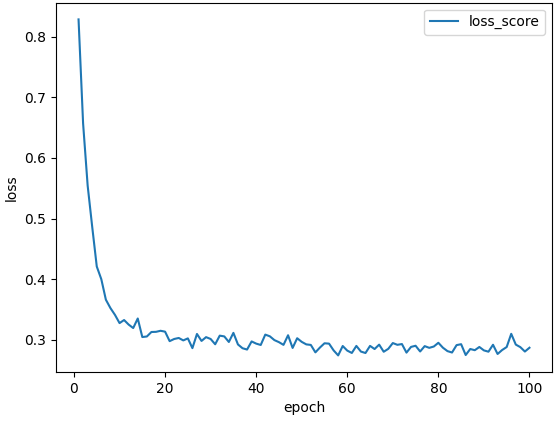

# Adversarial and Score-Based CT Denoising: CycleGAN vs Noise2Score

This repository provides the code, configuration files, and reproducible experiments for the article  
**“Adversarial and Score-Based CT Denoising: CycleGAN vs Noise2Score.”**

It implements and compares two complementary paradigms under a unified CT denoising framework:

- **CycleGAN-based Residual Translator** — an *adversarial*, *unpaired* image translation model.  
- **Noise2Score (N2S)** — a *score-matching*, *self-supervised* denoising model.

The repository enables **fair benchmarking** and **reproducible evaluation** across both paradigms.  
It includes training and testing scripts, dataset preparation utilities, and result analysis modules (PSNR, SSIM).  
The implementation focuses on clarity, minimal dependencies, and ease of extending to new datasets or model architectures.

📝 You can read the full article here:  
👉 [Arxiv](https://arxiv.org/pdf/2511.04083)

## 🚀 Learning Framework

### CycleGAN-based Residual Learning Framework

  

### Noise2Score Learning Framework

  

---

## 🔍 Evaluation

### Qualitative Evaluation

  

### Training Loss Curves in CycleGAN

<table>
  <tr>
    <td align="center" width="50%">
      
       
      <em>Adversarial Loss</em>
    </td>
    <td align="center" width="50%">
      
       
      <em>Cycle + Identity Loss</em>
    </td>
  </tr>
</table>

### Training Loss Curves in Noise2Score

  

